# Lane detection for ADAS application with sliding windows technics

>Lane Finding demo, Image Credit : nguyenrobot &#8595;  

We will make a line detection algorithm which could be used for ADAS (Advanced Driving Assistance System) applications. Of course, many calibrations and testings should be done before to get our algorithm matured at industrial reliability. Further, the performance and the reliability of our codes need to be improved to be able to implement on Raspberry or Nvidia Jetson scale systems, which is the final objective at the end of my series of tutorials.

Line detection in this tutorial will cover :
- [x] Line detection of ego vehicle's current lane  
- [x] Line detection of ego vehicle's next lane (next-left side and next-right lane)  
- [x] Confidence level of each detected line  
- [x] Line-type of each detected line  
- [x] Lane-changing signal  
- [x] Curve-fitting by 3-rd polynomial  

In this tutorial, basic and fundamental technics of computer vision are applied :
- [x] Camera's distorsion correction  
- [x] Color-space transform [RGB to HSL]  
- [x] Image pre-processing in HSL space  
- [x] Bird-eye view transform  
- [x] Gradient detection with Sobel Operator  
- [x] Curve fitting with sliding-windows  

*Author : nguyenrobot*  
*Copyright : nguyenrobot*  
*Video Credit : nguyenrobot*  
https://github.com/nguyenrobot  
https://www.nguyenrobot.com/  

*Current github repos*  
https://github.com/nguyenrobot/lane_detection_advanced_sliding_windows  

*My previous tutorial on line-detection based on Canny Filter and Hough Transform*  
https://github.com/nguyenrobot/line_detection_by_canny_gausian_hough_streamedvideo

*Main script : **main_highway_A5_lanechange_slope.py***  

# Part 1 : Technics

## 1.1 ADAS's needs on lane-finding
An ADAS system would have these main components :
- [x] Lane Keeping System (LKA) which takes ego vehicle in lane center in dangerous lane-changes situations. LKA could enventually be enhanced by emergency features (eLKA) as Over-Coming, Over-Taking and Road-Edge situations  
- [x] Advanced Emergency Sterring (AES) which activelly take ego vehicle beyond potential collision  
- [x] Advanced Emergency Braking (AEB) which activelly take control of braking system. AEB and AES is a perfection duo to be both activelly and passivelly avoid any kinds of potential collision  
- [x] Autonoumous Driving (AD) which makes adaptative cruise control, Traffic jams is also an interesting feature of AD  
- [x] Automatic Parking (AP) which is very helpful is difficult parking situations such as hill parking  

Among these ADAS components, LKA intensively relied on line detection and object tracking layers (another tutorial in my series will take charge of object tracking). Hence, LKA will need more information than just simple detected lines' equations :
- [x] Confidence level of detected lines : to planify and maintain control phase, the controller needs to know about the detection quality 
- [x] Line-type : basically, the controller needs to know if detected line is a solid (lane-crossing forbiden) or dashed to make reasonings. Furthuremore, some other types are yellow-solid, road-edge, barrier, double-line; they essentially to decide when to trigger the control phase, so the sensibility of the system  
- [x] Lane change signal : although ADAS controller could make reasonings based on detected lines' equations to know if a lane-crossing occurs, roughly a lane-crossing signal  
- [x] Curve-fitting of detected lines by a 3rd polynomial. So, why a 3rd degree polynomial ? \\(x = dy^3 + cy^2 + by + a \\)
    * from a, we can estimate lateral distance to the line
    * from b, we can estimate heading-angle of ego vehicle
    * from c, we can estimate the line curvature
    * from d, we can estimate the curvature's gradient
- [x] Next-lane information

## 1.2 Camera's distorsion correction

I use the Undistort function from OpenCV library to do the job. You can find all about complex mathematics behind it in OpenCV documentation here :  
https://docs.opencv.org/master/dc/dbb/tutorial_py_calibration.html  
https://docs.opencv.org/2.4/modules/calib3d/doc/camera_calibration_and_3d_reconstruction.html  
>*Image distorsion, Image Credit : OpenCV documentation &#8595;*  
  
Source : https://docs.opencv.org/2.4/modules/calib3d/doc/camera_calibration_and_3d_reconstruction.html

The idea of Undistort function is to take series of photos of a chessboard taken by the camera. Then we will find chessboard's corners in each image and try to figure out distortion coefficients thanks to these corners' position.
>*Image distorsion by S7's rear camera, Image Credit : nguyenrobot &#8595;*  
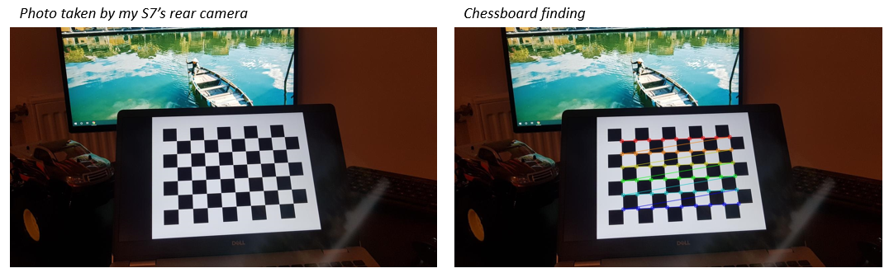

## 1.3 Image preprocessing
We can get inspired by photography post-processing to have a clean image before any computation :
- [x] Exposure balance : to correct the average exposure value of a frame
- [x] White balance : to correct the white balance exposure value of a frame
- [x] Highlight removing : to remove highlights, inspired by Lightroom
- [x] Shadow removing : to remove shadows, inspired by Lightroom
With these photography's post-processing inspired technics, we could archieve good results in various light condition and filter some noises.  

Then we will apply the color filtering to eliminate noises. A complusory step before color filtering is the color-space transform.
*Each input frame is in RGB (Red-Green-Blue) color space. However the perception of 'colour' of a pixel depends not only on R-G-B chanels value but also on the ratio between them.*
It's free to use HSL or HSV color space, in my tutorial I will use HSL color space.

>*HSL and HSV spaces, Image Credit : wiki &#8595;*  
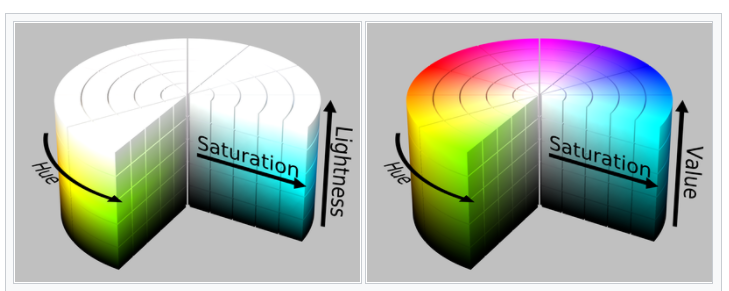  
Source : https://en.wikipedia.org/wiki/HSL_and_HSV

If you are intrigued by the mathematics behind, then you can check this very good article :  
https://www.niwa.nu/2013/05/math-behind-colorspace-conversions-rgb-hsl

To pick a color of a pixel, ImageGlass is a very versatile tiny software. It's sometimes to manually pick a pixel to analyze for filtering parameters :  
>*ImageGlass viewer, Image Credit : nguyenrobot &#8595;*  
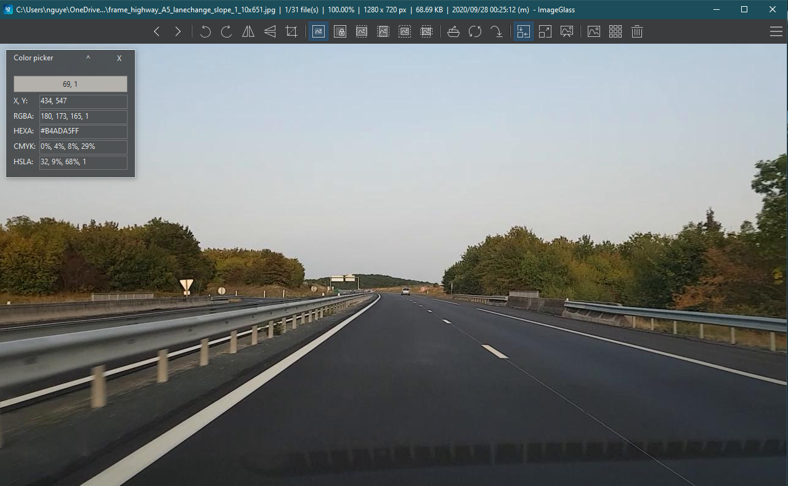
ImageGlass : imageglass.org
        
## 1.4 Bird-eye view transform
The bird-eye view transform help us to have a sky-view from vehicle view taken frame.

The bird-eye transform is simply linear stretching and compressing of input pixels. With a good tweaked bird-eye view transform, we should have lane's lines parallel in the end. This transform is also a source of error for line's curvature estimation bu we will discard these errors in this tutorial, enhancements should be done in a future tutorial.  

## 1.5 Gradient filter with Sobel Operator
In my previous tutorial, we used Canny edge and Gaussian filter to detect edges. However, with Canny Edge we can not know if an edge is 'horizontal' or 'vertical'. In lane's lines detection, we would like to keep nearly vertical edges and eliminate those nearly horizontal.  

Sobel operator is a simple way to filter pixels that could be on a lane's line. It's not robust as pattern recognition by convolutional neural-network but it's simple to implement and to tweak.  

The Sobel operator is here to helps us :
- [x] get partial derivatives of a pixel's value in x-direction and y-direction
- [x] get Gaussian filter which can smoothen pixels' values by comparing with its neighbours
With partial derivatives, we can calculate the magnitude and the argument of the gradient vector for each pixel.  

>*Sobel Operator outcomes, Image Credit : nguyenrobot &#8595;*  
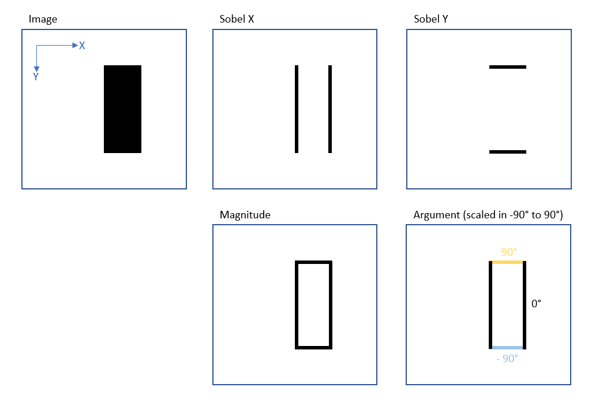

For further math calculus, opencv documentation explains pretty well here :  
https://docs.opencv.org/3.4/d2/d2c/tutorial_sobel_derivatives.html  
https://opencv-python-tutroals.readthedocs.io/en/latest/py_tutorials/py_imgproc/py_gradients/py_gradients.html

## 1.6 Curve fitting with sliding-widows
With Gradient and Color filters, we obtain a binary image of relevant pixels that could lay on a line.  
>*Binary bird-eye frame, Image Credit : nguyenrobot &#8595;*  

We make a count of pixels on vertical columns (each column is a vector of pixels) to have a histogram that give us the potential to have a line.
>*Histogram, Image Credit : nguyenrobot &#8595;*  

From each peak on the histogram, we initialize windows and then slide them vertically. Each window is horizontally centered in the end of each iteration by its detected pixels inside.
>*Sliding-windows, Image Credit : nguyenrobot &#8595;*  

Depending on the number of windows whose number of pixels inside requiring a minimum population, we can predict a confidence level of detected 'line' to say if it's a line or not.

## 1.7 Extrapolation error

3rd degree polynomial is needed for our line equations approximation. However, it gets oscillated easily for extrapolation, interpolation is very good in contrary.  

Here is an example of oscillated next-left line :
>*Oscillation caused by extrapolation of 3rd degree polynomial, Image Credit : nguyenrobot &#8595;*  
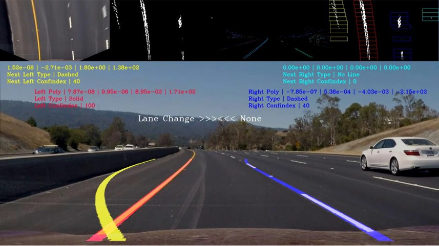
Source of raw image : Udacity

The oscillation is very annoying because when a line is badly extrapolated it's usually occurs near to the frame's bottom. This extrapolation strongly affect our estimation on space-left-in-lane and ego vehicle's heading angle. These information are crucial for low-level controller acting on the steering wheel.  

>*Oscillation caused by extrapolation, Image Credit : the Mathworks &#8595;*  
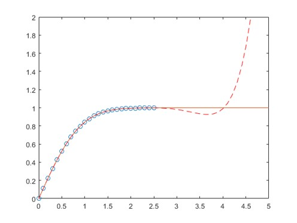  
Source : https://www.mathworks.com/help/matlab/ref/polyfit.html

So, to remediate this extrapolation error, I use a linear extrapolation for missing pixels of a line :
- [x] Linear extrapolation for missing line's pixels
- [x] Polyfit with a 3rd degree polynomial on detected pixels + linearly extrapolated pixels

# Part 2 : Coding
>*Youtube video with good results &#8595;*  
  
Source : http://www.youtube.com/watch?v=_O-LsAwi8LI

>*Youtube video with issues caused by over-taking target &#8595;*
  
Source : http://www.youtube.com/watch?v=l-PXK0ftR1g

## 2.1 Coordination Systems
>*Coordination Systems, Image Credit : nguyenrobot &#8595;*  
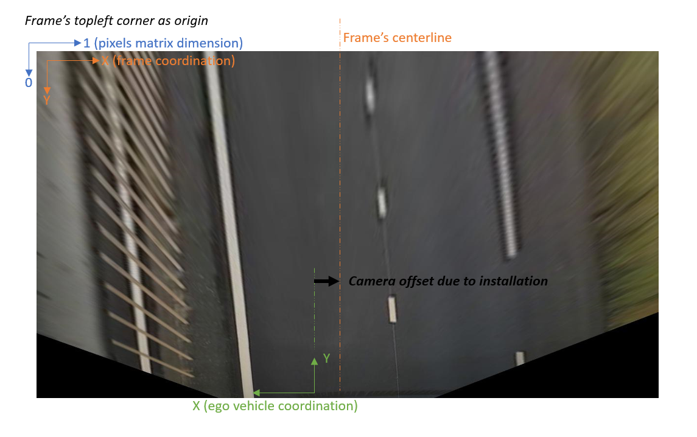

- [x] When an image frame [1280 x 720 x 3] is read with opencv, pixel (1280,720)'s chanel i value is picked by (720,1280,i) (like is swapped horizontal >> vertical by opencv reading)
- [x] Frame's origin is the top-left corner, this coordination is used for curve-fitting.
- [x] Ego vehicle's coordination is used to transform curve-fitting equations to has lane equations in vehicle's coordination system.

*#note : the camera offset is due to camera's lateral distancing from ego vehicle's origin, when the cameara is not installed on ego vehicle's center-line* 

## 2.2 Information extraction from line equation
From polyfit() for detected pixels on a line, we can obtain a 3-rd polynomial as :
\\[x = dy^3 + cy^2 + by + a \\]

*Notion of look-ahead distance
We could not-hardly get some basic information from the polynomial :
- [x] Space-left-in-lane
- [x] Heading-angle
- [x] Line's curvature

>*lane info - space-left, Image Credit : nguyenrobot &#8595;*  
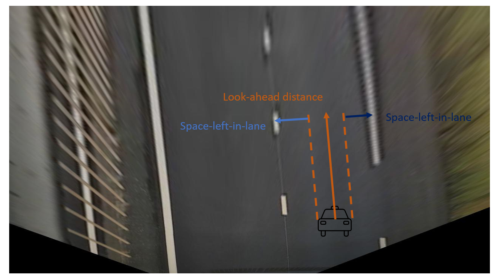

>*lane info - curvature & heading, Image Credit : nguyenrobot &#8595;*  
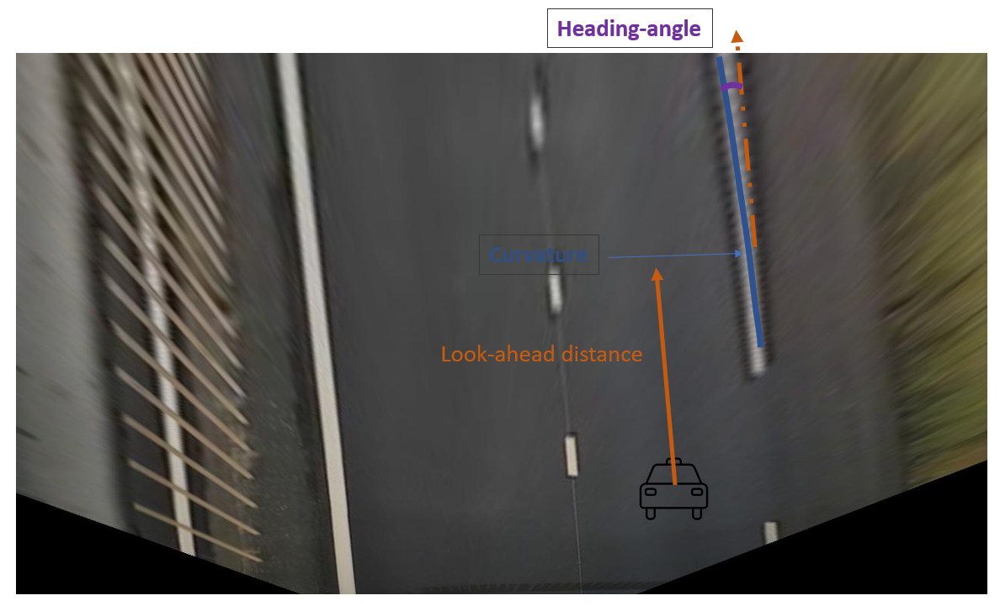

## 2.3 Camera Calibration
For my road videos, I used the rear camera of a Samsung S7 smartphone mounted behind my Ford Focus 1999 windshield. Astonishingly, distortion correction not really needed with videos filmed by S7's rear camera, they are well filtered and preprocessed so the video is pretty good that we can directly use without distortion correction. However, it's better to know about image distortion correction to be able to work with any kind of video input.  
>*Image distorsion by S7's rear camera, Image Credit : nguyenrobot &#8595;*  
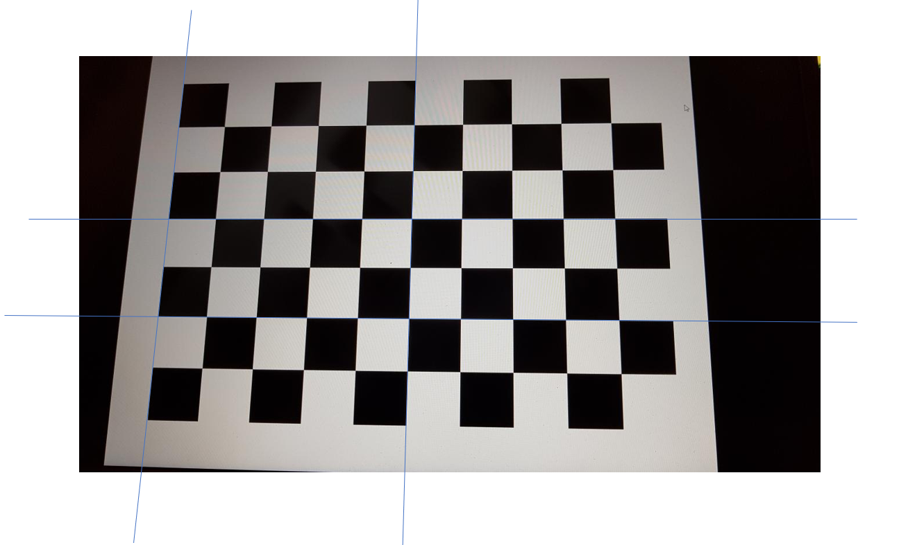

## 2.4 Image pre-processing
I made pre-processing and filtering on both vehicle-view frame and sky-view frame. Sometimes, each fullfills other.
>*Image pre-processing on sky-view, Image Credit : nguyenrobot &#8595;*  
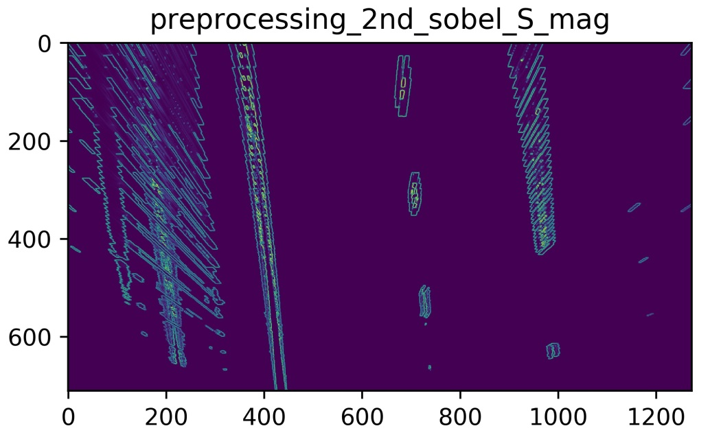

>*Image pre-processing on vehicle view, Image Credit : nguyenrobot &#8595;*  
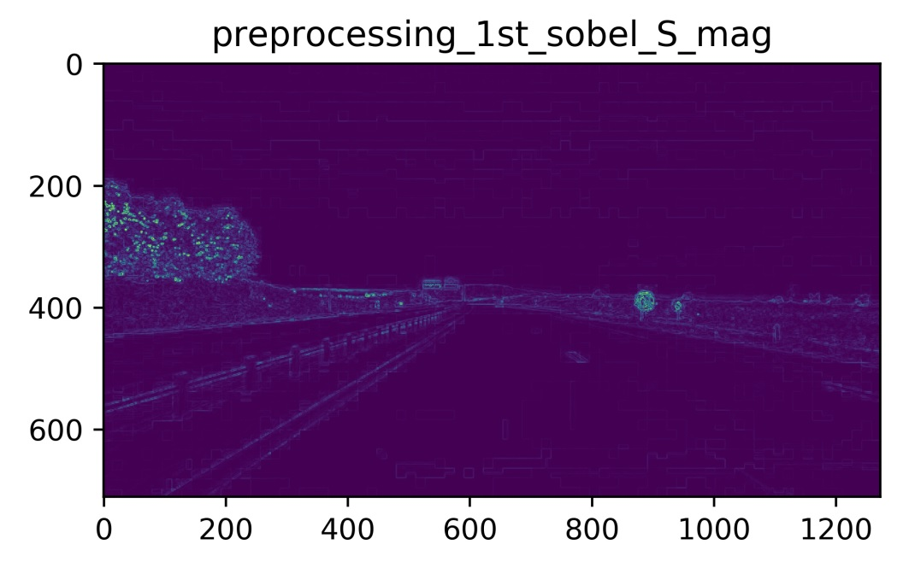

## 2.5 Pixel to meter
I have my smartphone S7 fixed by supports behind the windshield without any information of mounting geometry neither optical calibration of my camera.

How can I convert from pixel-dimension to meter-dimension ?
>*pixel to meter, Image Credit : nguyenrobot &#8595;*  
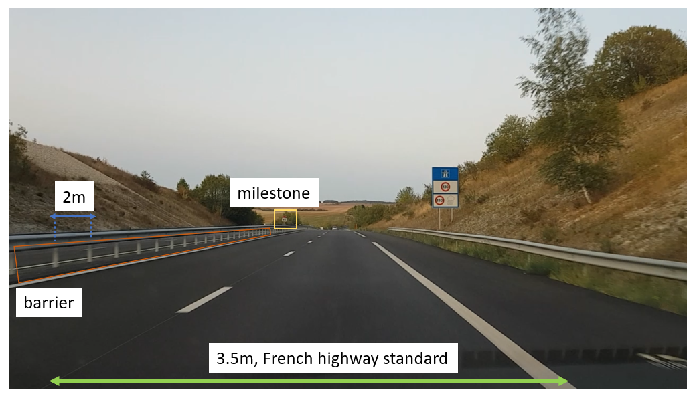

I get disposed information of French highway *(I filmed my videos on A5 French highway)* :
- [x] Standard lane-width is 3.5m for French highway
- [x] By counting the number of barrier supports (lane separator) between two consecutive mile-stone, I found that these barrier supports are 2m distanced from each other

From a well chosen bird-eye view frame, I can estimate pixel-to-meter ratio with acceptable precision
>*pixel to meter, Image Credit : nguyenrobot &#8595;*  

A well chosen frame is a frame that ego vehicle is heading straight ahead and is in the middle of the current lane.  
In the end, we can obtain linear coefficients to convert from pixel to m for longitudinal and lateral distances.  

## 2.6 Tweaking parameters for lane-finding algorithm

    param_preprocessing = \
                { 'thd_highlight_L':                255,                # mid L         # low-pass filter on H-chanel
                'thd_highlight_S':                  0,                  # low S         # low-pass filter on H-chanel
                'thd_shadow_L':                     30,                 # low L
                'thd_shadow_S':                     50,                 # high S       
                'thd_S_mag':                        25,                 # high S_mag 25
                'thd_S_arg':                        0,                  # high S_arg 25
                'thd_S_x':                          0,                  # high-pass filter on sobel of L-chanel in direction x, by defaut 35
                'thd_L_mag':                        20,                 # high L_mag 25   # high-pass filter on magnitude of sobel of L-chanel, by defaut 5
                'thd_L_arg':                        0,                      
                'thd_L_y':                          75}

    param_curve_class = \ 
                {'num_of_windows':                  15,                 # number of windows used for curve-sliding
                'histogram_width':                  75,                 # width of histogram for a curve, by defaut 200
                'histogram_seed' :                  64,                 # histogram seed used for vertical slices of histogram
                'histogram_vertical_ratio_end':     1,                  # height ratio used for histogram, 0.6 by defaut to end in ~2/3 from the top
                'histogram_vertical_ratio_start':   0,                  # height ratio used for histogram, 0 by defaut to start from the top
                'histogram_ratio_localmax':         1,                  # ratio of second max comparing to 1st, to be get picked
                'offset_cam' :                      125,                # offset from vehicle's centerline to camera's centerline (positive if cam on vehicle's left)
                'm_vehicle_width':                  1.8,                # [m] body width of ford focus 1999
                'm_look_ahead':                     10,                 # [m] look ahead distance, used for curvature and space-left-in-lane estimation
                'margin_x':                         50,                 # width of windows used for curve-sliding, by defaut 100
                'min_pixel_inside':                 50,                 # min pixel numnber inside a window
                'max_pixel_inside':                 4500,               # max pixel number inside a window to be considered as a line
                'max_width_not_a_line':             115,                # max width of a line, top eliminate much dispersed detectedpixels
                'min_pixel_confindex':              50,                 # min pixel numnber inside a window, used for confindex evaluation
                'xm_by_pixel':                      3.5/376,            # meter by pixel in x direction (horizontal)
                'ym_by_pixel':                      2/35,               # meter by pixel in y direction (vertical)
                'thd_confindex':                    33,                 # min confindex of a line
                'min_pixel_bold':                   150,                # min pixel inside a window of bold-type line (bold : barrier or road-edge)
                'min_pixel_doubleline':             150,                # min pixel inside a window of double-line-type line           
                'doubleline_width_px':              50,                 # min width of a double-line, in pixel unit
                'bold_width_px':                    75}                 # min width of a bold line, in pixel unit
                
## 2.7 Discriminative power of Sobel gradients' outcomes
This a summary of discriminative powers of each 1st and 2nd Sobel operations on different channel (H S L) :  
[1st degree Sobel operations - sobel_resum.pptx](file:images_jupyter/sobel_resum.pptx)

>*Sobel operations' discriminative power, an extract, Image Credit : nguyenrobot &#8595;*  
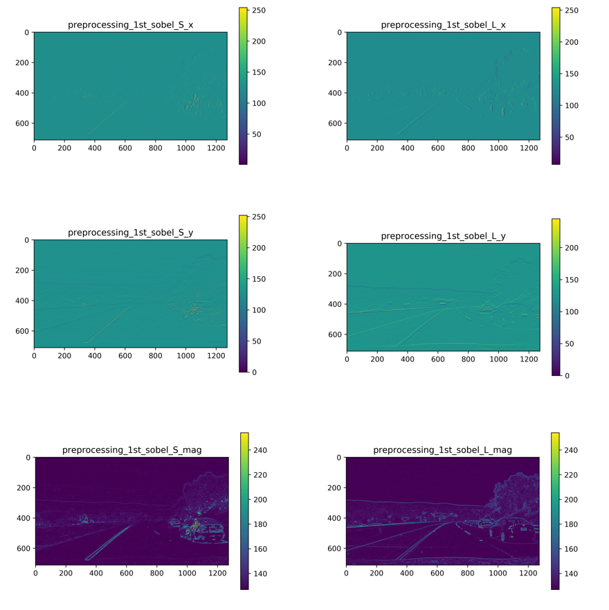  
Source : (file:images_jupyter/sobel_resum.pptx)

It's fun to have cross-combining of different kinds of Sobel operation to have effective filters.

# Wrapping up
There are so many things up to do for our algorithm's optimization and reliability.

- [x] **Line-type** : our algorithm distinguishes well solid and dashed-line. However, for other types as double-line, solid-yellow, barrier, road-edge we will need something more robust and more intelligent. Hence, a layer pattern recognition should be integrated for further release.
- [x] **Sobel vs Pattern** : filtering with Sobel gradient has its limits where pattern recognition finds its effectiveness.
- [x] **Sobel at higher degree** : I didn't exploit 2nd degree Sobel information even they are very effective for precision to enhance 1st degree Sobel information.
- [x] **Object detection** : road signs, road separator materials, vehicle detection - we did nothing about them in the algorithm. A convolutional neural network is needed for further release.
- [x] **Detection tracking** : each line is detected separately from frame-to-frame. A tracking object foreach detected line is needed also.
- [x] **Bird-eye view vs slope vs curve's radius** : bird-eye transform distort and and noises, it's less effective on hill-road.
- [x] **Algorithm's precision** : some tweakings and calibration on real situations are needed to make better estimations.
- [x] **Algorithm's performance** : frame sectioning, hybrid frame processing - it could be interesting for performance improvement. For the moment, our algorithm process frame-by-frame, which is not powerful and very slow.
    
*Next tutorials : Object Tracking and Driver-behaviour cloning with Neural Networks, stay tuned !*